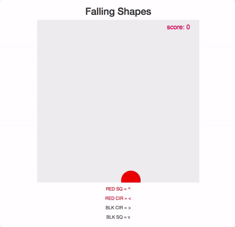

# Making HTML5 Games With Phaser


## Bio

__Tim Garcia__


* Computer Science undergrad @ UC Riverside, masters @ Georgia Tech
* 5 years @ Amazon working on different kindle products (kindle readers, kindle fire table, kindle cloud reader, etc)
* 3 Years teaching at Web Development Bootcamps
* Co-founder and Lead Instructor at [Rithm School](https://www.rithmschool.com).

__Contact__: Please get in touch!

* tim@rithmschool.com
* [@timgarcia0](https://twitter.com/TimGarcia0)

## Objectives

* Why phaser?
* Understand how a canvas element works (phaser uses this to render your game).
* Create a phaser game that uses the physics engine
* Game architecture


## PhaserJS


Phaser is a 2d game library built on html5 standards.

[Richard Davey](https://github.com/photonstorm) created the project in 2012 as a weekend experiment.  Over time, it exploded in popularity.

Phaser is the most popular javascript gaming framework on github (by stars) and continues to grow.  You can see Richard Davey's 2016 year in review [here](http://phaser.io/news/2016/12/phaser-in-2016-and-beyond).  

You can see some games that were build with phaser [here](https://phaser.io/games)

### Why Choose Phaser

There are some compelling reasons to choose phaser as a gaming platform:

1. Easy installs.  Most people have compatible browsers and internet access.  No need to ship a binary and worry about system dependencies.
2. Fun and fast paced development.  You can quickly iterate and debug your game with all the tools available to you in Chrome.
3. Community support.  The [html 5 game devs](http://www.html5gamedevs.com/) forum provides lots of assistance for beginners.  Also there are many free tutorials available on phaser's website.


What it may not be best for:

1. Games with lots of 3d rendering.  Something like the Unity framework maybe a better choice.

### Phaser 2 Internals

Phase 2 (the current version of phaser), relies heavily on a modified version of [PixieJS](http://www.pixijs.com/)

Pixie is a library used to manipulate html5 canvas elements.  In order to understand how these games are working, we'll take a moment to learn a bit about canvas.

## Canvas Introduction


A canvas is an html element that allows the developer to draw shapes, text, etc.  It was originally introduced by Apple as an attempt to make the web more dynamic.

### History

In 2012, there was already a standard that allowed you to draw, SVG (scalable vector graphics).  When apple introduced canvas, people we skeptical about the need for a second element for drawing.

Apple also was toying with the idea of making canvas proprietary and making other companies pay for a license to use the technology. Lucky, canvas was not held hostage, and it has become a standard part of the browser.  IE9+, Chrome, Safari and Firefox all support canvas.

### Canvas vs SVG

 
 
A canvas element has some advantages that make it ideal for games:

1. Canvas allows for direct pixel access.  Often we need to directly manipulate pixels in games.
2. The canvas element does not manage a DOM.  Conversely, SVG is DOM based.  It means that you have to do more work in a canvas to manage the state yourself but often you get the benefit of performance.

### Using Canvas


Here is a basic canvas tag:

```html
<canvas height="200" width="200">
	This text is shown to the user if the browser does not support canvas
</canvas>
```

Your imagination is the only thing holding you back with the canvas element.  This tuts plus article, [21 Ridiculously Impressive HTML5 Canvas Experiments](https://code.tutsplus.com/articles/21-ridiculously-impressive-html5-canvas-experiments--net-14210), gives some really cool examples of what is possible.

We have much more modest goals for this lesson.  We are going to go over the basic canvas setup, drawing a few shapes, and then make our shapes move.

### Canvas Setup

To create your first canvas element, let's start with this html:

```html
<!DOCTYPE html>
<html>
<head>
  <title>Canvas Intro</title>
  <link rel="stylesheet" type="text/css" href="style.css">
</head>
<body>
  <canvas id="my-canvas"></canvas>
</body>
</html>
```

And this code for `style.css`:

```css
#my-canvas {
	background-color: blue;
	height: 400px;
	width: 400px;
}
```

If you open up your html page in a browser, you should see a blue html canvas on the screen!

Now, open up your javascript console, and get the canvas element by doing the following:

```js
var canvas = document.getElementById("my-canvas");
```

Next, we'll start adding elements to the canvas, but first we need to understand the x and y coordinate system.

### Coordinates System in Canvas

In the canvas coordinate system, the **x** coordinate grows from the left side of the element to the right and the **y** coordinate grows from the top of the canvas to the bottom.

This coordinate system can seem not very intuitive to some people since they are used to graphs from math where the y value gets larger from bottom to top, but once you get the hang of it, you'll be fine.

We also want to make sure that the width and height of our canvas is the same as the width and height on the page.  Try doing the following in the console:

```js
var canvas = document.getElementById("my-canvas");
console.log("width: ", canvas.width, "height: ", canvas.height);
```

The above code should return a width of 300 and a height of 150, but our canvas has a different dimension on the page.  In fact, 300 and 150 are the default values of width and height for a canvas element.  The difference of the canvas dimensions and the real world pixel dimensions will lead to confusion and problems, so the easiest thing to do is update the canvas size to the values from our style:

```js
var canvas = document.getElementById("my-canvas");
canvas.width = canvas.scrollWidth;
canvas.height = canvas.scrollHeight;
```

### WebGl vs 2D Context


When drawing on a canvas, you must choose which drawing context you want to use.  While learning canvas, we'll use a 2D context which does not have 3D support.

WebGL is a 3D context that can take advantage of the graphics card on your computer (uses GPU rather than CPU for certain operations).

Even though we will not be using 3D features, often rendering in WebGL is faster than a 2D context because of the GPU.

### Drawing

Once you have the canvas element, the next thing you need is the context for drawing.  The context is the object that actually let's you draw to the screen.  To get the context, do the following:

```js
var ctx = canvas.getContext('2d');
```

With the context, draw a rectangle:

```js
var upperLeftX = 0;
var upperLeftY = 0;
var width = 50;
var height = 50;
ctx.fillRect(upperLeftX, upperLeftY, width, height);
```

The above code creates a black rectangle on our blue canvas.  To draw with a different color, we need to specify the `fillStyle`:

```js
ctx.fillStyle = "orange";
ctx.fillRect(upperLeftX, upperLeftY, width, height);
```

Next, let's draw a triangle.  There is no build in way to draw a triangle, but rather you can create a path that defines a shape.  So our path will need 3 points:

```js
ctx.fillStyle = "red";
ctx.beginPath();
ctx.moveTo(0,0);
ctx.lineTo(40, 40);
ctx.lineTo(0, 80);
ctx.fill();
ctx.closePath();
```

Let's say you've drawn somethings, and now you want to clear the screen and start over.  To do that, you can use `clearRect`:

```js
var canvasWidth = 400;
var canvasHeight = 400;
ctx.clearRect(0, 0, canvasWidth, canvasHeight);
```

__Exercise__

Figure out how to draw text and a circle on the canvas.


### Making Things Move

To create movement in the canvas, you need to draw something, clear the screen, then draw something again that has moved slightly.

Before we get there, let's clean up our code a little.  In the example below, the code for drawing a square is kept inside of the square object. The square object is responsible for drawing itself based on the properties that it has:

```js
var canvas = document.getElementById("my-canvas");
canvas.width = canvas.scrollWidth;
canvas.height = canvas.scrollHeight;
var ctx = canvas.getContext('2d');
	
var square = {
	corner: [0,0],
	width: 50,
	height: 50,
	color: "red",
	draw: function() {
		ctx.fillStyle = this.color;
		ctx.fillRect(this.corner[0], this.corner[1], this.width, this.height);
	}
}
	
function draw() {
	ctx.clearRect(0, 0, canvas.width, canvas.height);
	square.draw();
}

draw();
```

The first step to adding movement is to create a drawing loop using `setInterval`.  So rather than calling the `draw` function directly, setInterval will call it.  The more frequently we call draw, the higher the _frame rate_ of our motion is.  In other words, the _frame rate_ is the number of screens drawn per second.  If we draw a frame every second, we would have a frame rate of 1 frame per second. Typically, if you want the motion too look natural, you want a frame rate of at least 20 frames per second:

```js
// Drawing every 50ms = 20 draws in 1 second or 20 fps
var intervalId = setInterval(draw, 50);
```

Now in the console if you do the following:

```js
square.corner = [50, 50];
```

You should see the square being redrawn somewhere else.

Now to make the square move diagonally across the screen, modify the draw function to update the corner of the square slightly on each draw:

```js
function draw() {
	ctx.clearRect(0, 0, canvas.width, canvas.height);
	square.corner[0] += 2;
	square.corner[1] += 2;
	square.draw();
}
```

Now you should see a square moving diagonally across your screen!

__EXERCISE__

Once the square is off of the screen, move it back to a visible spot.

Although we are not directly manipulating canvas elements in phaser, understanding the mechanics here will be useful when we create our games.

## Phaser Intro

Now that we have a solid understanding of what phaser is using underneath, let's build a game.  We will be building a brain speed game.  The goal is to press the correct arrow key before the shape falls to the bottom of the screen:




Let's start with the html.  I've added bootstrap incase we want to style our pages :

```
<!DOCTYPE html>
<html>
<head>
  <title>Falling Shapes</title>
  <link rel="stylesheet" type="text/css" href="index.css">
</head>
<body>
  <h2>Falling Shapes</h2>
  <div id="game">
  </div>
  <div>
    <p class='red'>RED SQ = ^</p>
    <p class='red'>RED CIR = &lt;</p>
    <p>BLK CIR = &gt;</p>
    <p>BLK SQ = v</p>
  </div>
  
  <script src="//cdn.jsdelivr.net/phaser/2.6.2/phaser.js"></script>
  <script type="text/javascript" src="index.js"></script>
</body>
</html>
```

Notice at the bottom of the body, we've added `phaser.js` from a CDN and `index.js` which we'll use to implement our game.

In `index.js`, the first thing we need to do is create our Phaser game:

__Initial Setup__

The parameters to a Game are in the [phaser docs](http://phaser.io/docs/2.6.2/Phaser.Game.html)

The first two arguments are the height and with of the canvas.  

Next, `Phaser.AUTO` tells phaser to use whichever context it thinks is best. (It will take WebGL if its available and fall back to 2d if WebGL is not there.  This is almost always what you want).

Finally we are setting the state for phaser.  These are the functions we'll use to implement our game:


```
const game = new Phaser.Game(500, 500,
  Phaser.AUTO,
  document.getElementById("game"),
  {preload, create, update});
```

Next, create our 3 functions:

```
function preload() {
}

function create() {
}

function update() {
}
```

First, do any initial setup in preload (this is where you load images if you have any).

```
let score;
function preload() {
  game.stage.backgroundColor = '#eee';
  score = 0;
}
```

If you refresh the page, you should see a grey square with nothing happening. You've created your first game!

__Show Score__

Next, let's show our score on the screen:

```
let scoreText;
function create() {
  let styles = {font: "20px Arial",fill: "#ff0044"}
  scoreText = game.add.text(game.world.width-100, 10, `score: ${score}`, styles);
}
```

Notice that I'm not directly using the width of 500 here. That is important for later when we want to make our game scale.

__Load Image__

Next, let's create a sprite by grabbing an image from the web:

In preload, we'll load the image:

```
function preload() {
  // ...
  const img = 'img/rithm.png';
  game.load.image('rithm', img);
}
```
Now in create, we need to put that image inside of a sprite.  We want to use the physics engine for phaser and it knows how to deal with sprites.

```
let rithm;
function create() {
  // ...
  
  rithm = game.add.sprite(game.world.width * 0.5, game.world.height * 0.2, 'rithm');
  rithm.anchor.set(0.5, 0.5);
  game.physics.arcade.enable(rithm);
  
}
```

__EXERCISE__

The update method is similar to our draw method in the canvas example.  Use `rithm.body.x` and `rithm.body.y` to change position.


__The Power of Physics__

Now that we are using a physics engine, we can do less manual updating of position:

```
let rithm;
function create() {
  // ...
  
  rithm = game.add.sprite(game.world.width * 0.5, game.world.width * 0.2, 'rithm');
  rithm.anchor.set(0.5, 0.5);
  game.physics.arcade.enable(rithm);
  rithm.body.velocity.set(0, 100);
  
}
```

We can also add:

```
rithm.body.collideWorldBounds=true;
```
and then:

```
rithm.body.bounce.set(.70);
```

__EXERCISE__

Make two sprites on the screen.  Have them collide!


__Collision Detection__

You may have gotten to the two sprites on the screen and moving, but there's a chance they didn't collide!  That is because we aren't checking for that.  We need to detect the collision in update:

```
function update() {
  game.physics.arcade.collide(rithm, rithm2);
}
```

Now on each update we are checking if the two sprites collide.

__Using Canvas Shapes__

Sprites are one of the few things Phaser arcade physics knows how to work with.  So if you want to create a canvas element, you must wrap it in a sprite:

```
  shape = game.add.graphics(game.world.width*0.5, game.world.height* 0.5);
  shape.beginFill(0xFF0000);
  shape.drawCircle(0,30,60);
  shapeSprite = game.add.sprite(0, 0);
  shapeSprite.addChild(shape);
  shapeSprite.anchor.set(0.5,0.5);
  game.physics.enable(shape, Phaser.ARCADE);
  shape.body.velocity.set(0, 70);
  shape.body.collideWorldBounds=true; 
```

__Add A Group__

```
  rithms = game.add.physicsGroup();
  rithms.enableBody = true;
  rithm = rithms.create(game.world.width * 0.5, game.world.height * 0.2, 'rithm');
  rithm2 = rithms.create(game.world.width * 0.5, game.world.height * 0.8, 'rithm');
  rithm.body.velocity.set(0, 100);
  rithm2.body.velocity.set(0, -100);
  rithms.setAll('body.bounce.y', 1);
  rithms.setAll('body.collideWorldBounds', true);
```

__Create Random Shape__

```
function createRandomShape() {
  isCircle = Math.floor(Math.random() * 2) > 0;
  color = [0xFF0000 /*red*/, 0x000000/*black*/][Math.floor(Math.random() * 2)];
  let shapeSprite;
  let shape;
  let height = game.world.height * (Math.random() * 0.4 + .3);
  let width = game.world.width * (Math.random() * 0.4 + .3);
  if (isCircle) {
    shape = game.add.graphics(width, height);
    shape.beginFill(color);
    shape.drawCircle(0,30,60);
  } else {
    shape = game.add.graphics(width, height);
    shape.beginFill(color);
    shape.drawRect(0,0,60,60);
  }
  shapeSprite = game.add.sprite(0, 0);
  shapeSprite.addChild(shape);
  shapeSprite.anchor.set(0.5,0.5);
  return shape;
}
```

__Make the Shape Fall__

```
function setupFallingShape() {
  game.physics.enable(fallingShape, Phaser.ARCADE);
  fallingShape.body.velocity.set(0, 70);
  fallingShape.checkWorldBounds = true;

  fallingShape.events.onOutOfBounds.add(function(shape){
    shape.kill();
    score--;
    updateScore();
    fallingShape = createRandomShape();
    setupFallingShape(fallingShape);
  }, this);
}
```

__Keyboard Events__


```
function handleKeyUp(e) {
  if (e.keyCode == Phaser.Keyboard.UP ||
      e.keyCode == Phaser.Keyboard.DOWN ||
      e.keyCode == Phaser.Keyboard.LEFT ||
      e.keyCode == Phaser.Keyboard.RIGHT) {
    let correct = false;
    if (e.keyCode == Phaser.Keyboard.LEFT) {
      if (color === 0xFF0000 && isCircle) {
        correct = true;
      }
    } else if (e.keyCode == Phaser.Keyboard.RIGHT) {
      if (color === 0x000000 && isCircle) {
        correct = true;
      }
    } else if (e.keyCode == Phaser.Keyboard.UP) {
      if (color === 0xFF0000 && !isCircle) {
        correct = true;
      }
    } else if (e.keyCode == Phaser.Keyboard.DOWN) {
      if (color === 0x000000 && !isCircle) {
        correct = true;
      }
    }
    if (correct) {
      fallingShape.kill();
      fallingShape = createRandomShape();
      setupFallingShape(fallingShape);
      score++;
    } else {
      score--;
    }
    updateScore();

  }
}

```